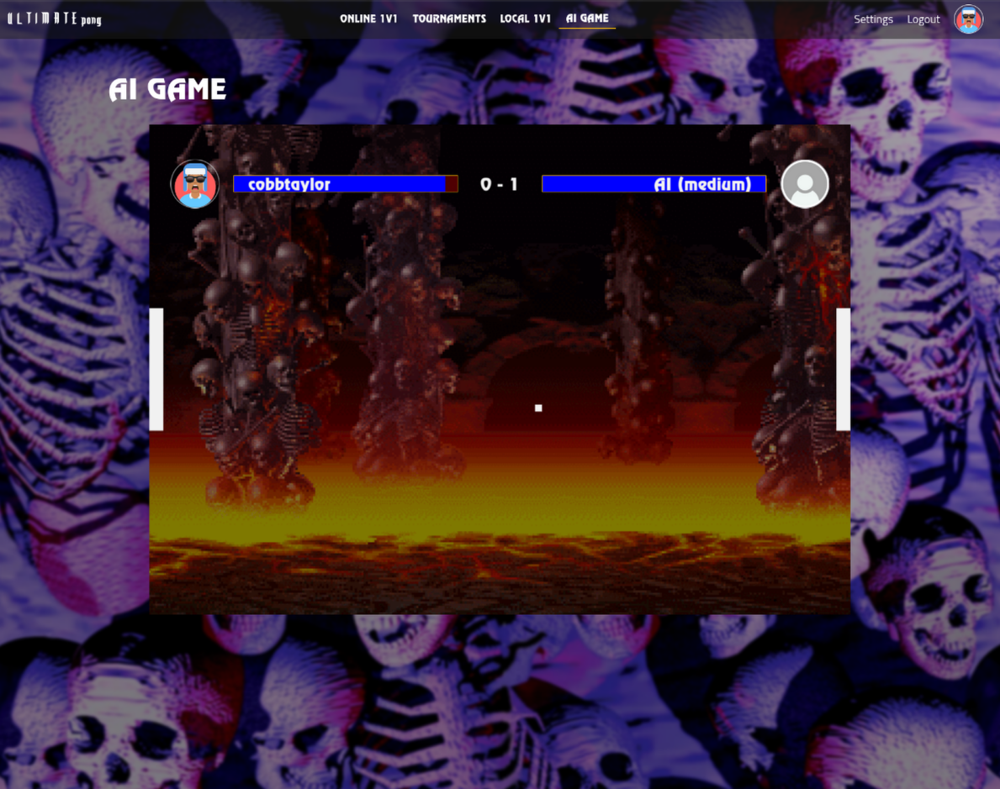
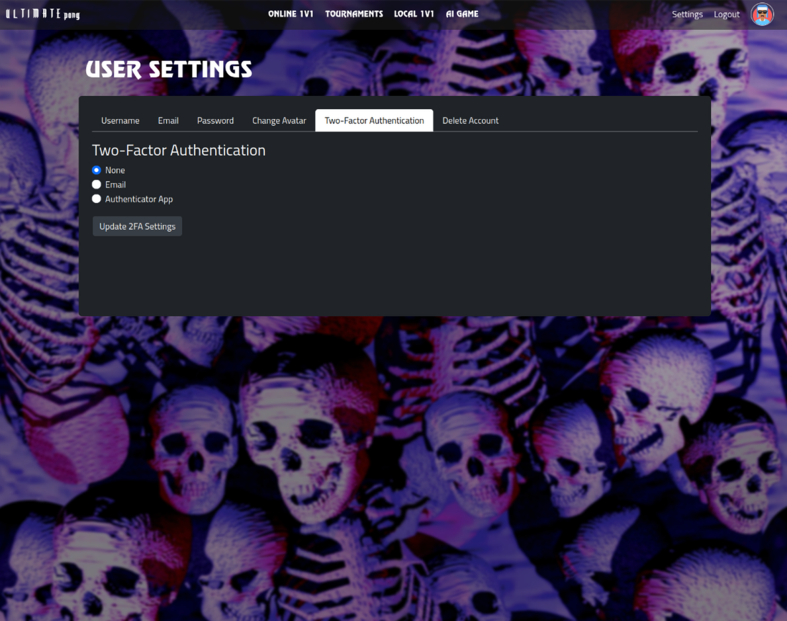

<h1 align="center">
	📖 42_Transcendence
</h1>

<h2 align="center">
	42 Lisbon Cursus - 🎉 Final Project 🎉
</h2>

	
	
	

1. [Summary](#summary)
2. [Tools](#tools)
4. [Our Implementation](#our-implementation)
5. [Setup](#setup)
6. [Running the Application](#running-the-application)
7. [Subject](#subject)

## Summary

Pong is a full-stack web application that allows users to play games of Pong remotely, locally and against AI, as well as participating in tournaments.

     
     
     
     
     

## Tools

|                                 |                                                         |
| ------------------------------- | ------------------------------------------------------- |
| **Containerization**            | Docker, Docker Compose                                  |
| **Backend**                     | Django, Django REST Framework, PostgreSQL, Redis        |
| **Frontend**                    | NodeJs, Webpack, JavaScript, HTML, CSS, SCSS, Bootstrap |
| **Blockchain**                  | Truffle, Ganache, Solidity                              |
| **Authentication**              | Simple JWT, OAuth2 (42 Integration)                     |
| **Monitoring**                  | Prometheus, Grafana, Alertmanager                       |
| **Metrics Exporters**           | Redis Metrics Exporter, PostgreSQL Metrics Exporter     |
| **Secrets Management**          | HashiCorp Vault                                         |
| **WebSockets**                  | Django Channels, Daphne, Channels-Redis                 |
| **Security**                    | Nginx, ModSecurity WAF                                  |
| **Profiling and Documentation** | Silk Profiling, Redoc, Swagger                          |

## Our implementation

	 

### Web App (JavaScript, Bootstrap, Webpack)

- A Single Page Application (SPA) utilizing a class-based system for managing navigation and rendering of pages and components.
- Renders the user interface and handles client-side logic.
- Connected directly to the reverse proxy and communicates with backend services.
- State is updated on WebSocket events, API calls, and user interactions.
- Implements the **Observer pattern**, allowing pages and components to subscribe to state changes and re-render when necessary.

### Reverse Proxy Layer (Nginx)

- Serves as the entry point for all client requests.
- Routes traffic between the frontend and backend services.

### Security Layer (WAF)

- **Firewall**: Network-level protection that filters traffic between the reverse proxy and backend.

### Backend Core (Django)

- Online Pong games run on the Django application. Consumers connect and send game updates to the players.
- **WebSocket consumers** handle updates on:
  - Friend invitations
  - Game invitations
  - Tournament progress
  - Online statuses
- **Django REST Framework** powers the backend API, managing tasks that don't require live updates, such as:
  - User management
  - Authentication
  - Game invitations
- **Authentication**:
  - Simple JWT is used to manage authentication.
  - A custom OAuth2 backend handles 42's OAuth2 integration.

### Cache Layer (Redis)

- Improves performance by storing frequently accessed data.

### Database Layer (PostgreSQL)

- Stores all persistent application data.

### Blockchain Service (Truffle, Ganache, Solidity)

- **Ethereum-based service** connects directly to the Django backend and stores game scores on the blockchain.

### HashiCorp Vault

- **Secure secrets management** connected directly to the Django backend for accessing credentials and secrets.

### Monitoring Services

- **Prometheus**: Collects metrics from various services.
- **Grafana**: Visualizes metrics and provides dashboards for monitoring.
- **Alertmanager**: Sends alerts based on Prometheus rules.

### Metrics Exporters

- **Redis Metrics Exporter**: Collects metrics from the Redis cache.
- **PostgreSQL Metrics Exporter**: Monitors database health and performance.

### Docker Integration

- All components are containerized using Docker.

### Data Flow Architecture

1. **Client requests** (API Client and Web App) enter through the Nginx reverse proxy.
2. The reverse proxy routes requests to either the Frontend or through the Firewall.
3. The Firewall filters traffic to the Django Backend.
4. The Django Backend processes requests, interacting with:
   - **PostgreSQL Database** for persistent storage.
   - **Redis Cache** for performance optimization.
   - **Blockchain Service** for Ethereum integration.
   - **HashiCorp Vault** for accessing secrets.

### Real-time Communications

- Handled via **WebSockets** from the Django backend:
  - Consumers connect and send game updates to Pong players.
  - WebSocket consumers handle updates on friend invitations, game invitations, tournament progress, and online statuses.

### RESTful Tasks

- Managed by **Django REST Framework** for tasks that don't require live updates:
  - User management
  - Authentication (Simple JWT and custom OAuth2 backend for 42's integration)
  - Game invitations

---

## Setup

### Prerequisites

- Ensure ports 8080 and 8000 are free on your machine.
- Docker and Docker Compose should be installed.
  
Copy the example environment from `.env.example` to `.env`. If needed, update credentials such as email client and 42's OAuth2.

## Running the Application

The following commands are available in the Makefile:

| Command                                                   | Description                                                                                                                  |
| --------------------------------------------------------- | ---------------------------------------------------------------------------------------------------------------------------- |
| `all`                                                     | Build and tun all services                                                                                                   |
| `up`, `down`, `build`, `clean`                            | Perform the respective Docker Compose commands.                                                                              |
| `backend`, `frontend`, `db`, `cache`, `blockchain`, `waf` | Starts the respective service.                                                                                               |
| `create_users`                                            | Creates a set of users on the backend app and database.                                                                      |
| `frontend-stop`                                           | Stops the frontend container.                                                                                                |
| `frontend-build`                                          | Compiles and bundles the frontend files for the browser using Webpack.                                                       |
| `frontend-dev`                                            | Stops the frontend container and starts it in development mode.                                                              |
| `frontend-prod`                                           | Stops the frontend container and starts it in production mode.                                                               |
| `blockchain_startmonitor`                                 | Starts monitoring games that have been completed or interrupted in the PostgreSQL database and saves them to the blockchain. |
| `blockchain_stopmonitor`                                  | Stops the game monitoring process, preventing new games from being automatically recorded in the blockchain.                 |
| `blockchain_listallgames`                                 | Lists all games that have been recorded in the blockchain.                                                                   |
| `blockchain_gamesbyplayers <player_id>`                   | Retrieves all games in which a specific player has participated, using their player ID.                                      |
| `blockchain_gamesbytournament <tournament_id>`            | Retrieves all games associated with a specific tournament, using the tournament ID.                                          |

### Accessing the Applications

- Frontend: https://localhost
- Django Admin: https://localhost/api/admin/
- Silk Profiling: https://localhost/api/silk/
- Swagger: https://localhost/api/swagger/
- Redoc: https://localhost/api/redoc/

## Subject
[📗️](en.subject.pdf) 
