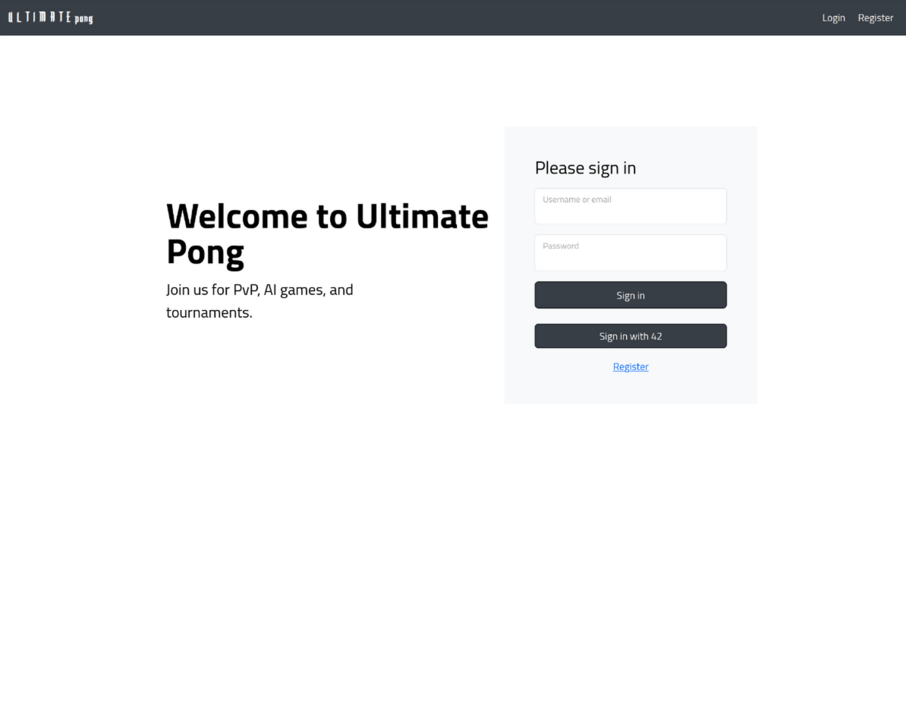
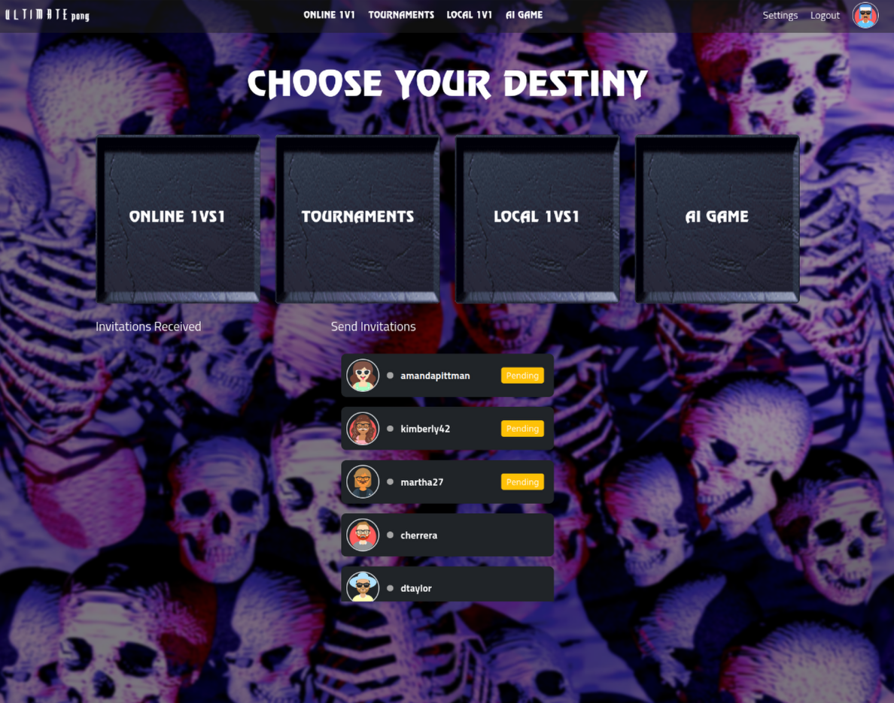

<h1 align="center">
	📖 42_Transcendence
</h1>

<h2 align="center">
	42 Lisbon Cursus - 🎉 Final Project 🎉
</h2>

	
	
	

## Summary

A full-stack web application that allows users to play games of Pong remotely, locally and against AI, as well as participating in tournaments.

     
     
     
     
     

## Tools

|                                 |                                                         |
| ------------------------------- | ------------------------------------------------------- |
| **Containerization**            | Docker, Docker Compose                                  |
| **Backend**                     | Django, PostgreSQL, Redis                               |
| **Frontend**                    | NodeJs, Webpack, JavaScript, HTML, CSS, SCSS, Bootstrap |
| **Profiling and Documentation** | Silk Profiling, Redoc, Swagger                          |
| **Blockchain**                  | Faundry, Anvil, Solidity                                |
## Subject
[📗️](en.subject.pdf) 

## Features
- Django as backend Framework.
- Standard user management, authentication, users across tournaments.
- Remote authentication using 42's OAuth2.
- Two-Factor Authentication (2FA) and JWT.
- Remote (Online) players.
- AI opponents.
- Blockchain - The score of each game is recorded in a blockchain.
- PostgreSQL as database.
- Bootstrap as a front-end tooltik.
- Browser Compatibility: Chrome, Firefox.
  
## Our implementation

#### Frontend:

- A Single Page Application (SPA) utilizing a class-based system for managing navigation and rendering of pages and components.
- It communicates with the backend using RESTful APIs and WebSockets, allowing for real-time updates.
- App, pages and components have their own state management. State is updated on WebSocket events, API calls, and user interactions.
- Using the Observer pattern, pages and components can subscribe to state changes and re-render when necessary.

#### Backend:

- Online Pong games run on the Django application. Consumers connect and send game updates to the players.
- Consumers also handle updates on friend invitations, game invitations, tournament progress, and online statuses.
- Django REST Framework powers the backend API, managing tasks that don't require live updates, such as user management, authentication, and game invitations.
- Simple JWT was used to manage authentication, while a custom OAuth2 backend handles 42's OAuth2 integration.

## Setup

### Prerequisites

- Ensure ports 8080 and 8000 are free on your machine.
- Docker and Docker Compose should be installed.
  
Copy the example environment from `.env.example` to `.env`. If needed, update credentials such as email client and 42's OAuth2.

## Running the Application

The following commands are available in the Makefile:

| Command                                                   | Description                                                                                                                  |
| --------------------------------------------------------- | ---------------------------------------------------------------------------------------------------------------------------- |
| `up`, `down`, `build`, `clean`                            | Perform the respective Docker Compose commands.                                                                              |
| `backend`, `frontend`, `db`, `cache`, `blockchain`, `waf` | Starts the respective service.                                                                                               |
| `create_users`                                            | Creates a set of users on the backend app and database.                                                                      |
| `frontend-build`                                          | Compiles and bundles the frontend files for the browser using Webpack.                                                       |
| `frontend-stop`                                           | Stops the frontend container.                                                                                                |
| `frontend-dev`                                            | Stops the frontend container and starts it in development mode.                                                              |
| `frontend-prod`                                           | Stops the frontend container and starts it in production mode.                                                               |
| `blockchain_startmonitor`                                 | Starts monitoring games that have been completed or interrupted in the PostgreSQL database and saves them to the blockchain. |
| `blockchain_stopmonitor`                                  | Stops the game monitoring process, preventing new games from being automatically recorded in the blockchain.                 |
| `blockchain_listallgames`                                 | Lists all games that have been recorded in the blockchain.                                                                   |
| `blockchain_gamesbyplayers <player_id>`                   | Retrieves all games in which a specific player has participated, using their player ID.                                      |
| `blockchain_gamesbytournament <tournament_id>`            | Retrieves all games associated with a specific tournament, using the tournament ID.                                          |

### Accessing the Applications

- Frontend: https://localhost
- Django Admin: https://localhost/api/admin/
- Silk Profiling: https://localhost/api/silk/
- Swagger: https://localhost/api/swagger/
- Redoc: https://localhost/api/redoc/
